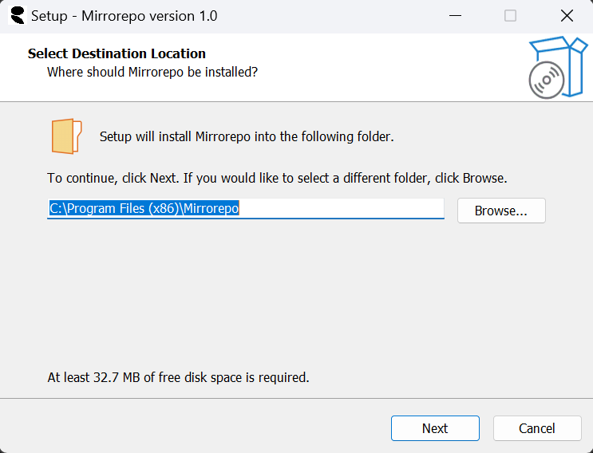

# Mirrorepo

## Overview

Mirrorepo is a tool designed for efficient code file consolidation with real-time updates and monitoring. Mirrorepo is ideal for developers who need to maintain a consolidated view of their codebase to prepare code for AI-assisted review.

## Installation

Click the MirrorepoSetup.exe and follow the instructions.

## How To Use
To convert code files to a single text file:
1. Select your code repo local folder.
2. Click List Files and confirm the files selected. Press Download to Text. 
4. Now copy and paste the downloaded text file into your favorite A.I. 
5. You can also use the Code Watcher to have the text file automatically update when a file changes in your local code repo. Just press 'Start Watching' button.

## Key Features

- File consolidation with custom filtering and metadata inclusion
- Real-time file watching and incremental updates
- Smart ignore patterns for common build and configuration folders
- Support for multiple popular programming languages
- Compression support for output files
- Cross-platform compatibility (Windows, macOS, Linux)
- Dark mode support
- Keyboard shortcuts for common operations
- Detailed logging and progress tracking

## Technical Specifications

- **Language:** Python 3.6+
- **GUI Framework:** Tkinter
- **File Watching:** watchdog library
- **Diff Algorithm:** difflib
- **Compression:** gzip
- **Encoding Detection:** chardet

## Features

1. **Source Folder Selection:** Choose the root folder containing your source code files.
2. **Output File Specification:** Select where to save the consolidated text file.
3. **File Extension Filtering:** Specify which file types to include.
4. **Ignore Patterns:** Set patterns for files or folders to ignore.
5. **Custom Separator:** Define a separator for file sections in the output.
6. **Compression Option:** Compress the output file to save space.
7. **File Listing:** Preview files that will be processed before consolidation.
8. **Download to Text:** Consolidate selected files into a single text file.
9. **Real-time Watching:** Monitor and update the consolidated file as changes occur.
10. **Dark Mode:** Toggle between light and dark interface themes.

## Performance Considerations

- Incremental updates minimize I/O operations
- Multi-threading support for large codebases
- Efficient diff algorithm for change detection
- Asynchronous file reading and writing for improved responsiveness

## Troubleshooting

1. **File Permission Issues:** Ensure appropriate read/write permissions for source and output directories.
2. **Watcher Not Detecting Changes:** Verify the correct folder is being watched and check IDE save behavior.
3. **High CPU Usage:** Exclude frequently changing files or large binary files using ignore patterns.
4. **Encoding Errors:** The tool attempts to detect file encoding, but may struggle with uncommon encodings.

## License

This project is licensed under the MIT License.

For more information or to report issues, please visit our [GitHub repository](https://github.com/flexfinRTP/mirrorepo).

## Mirrorepo
