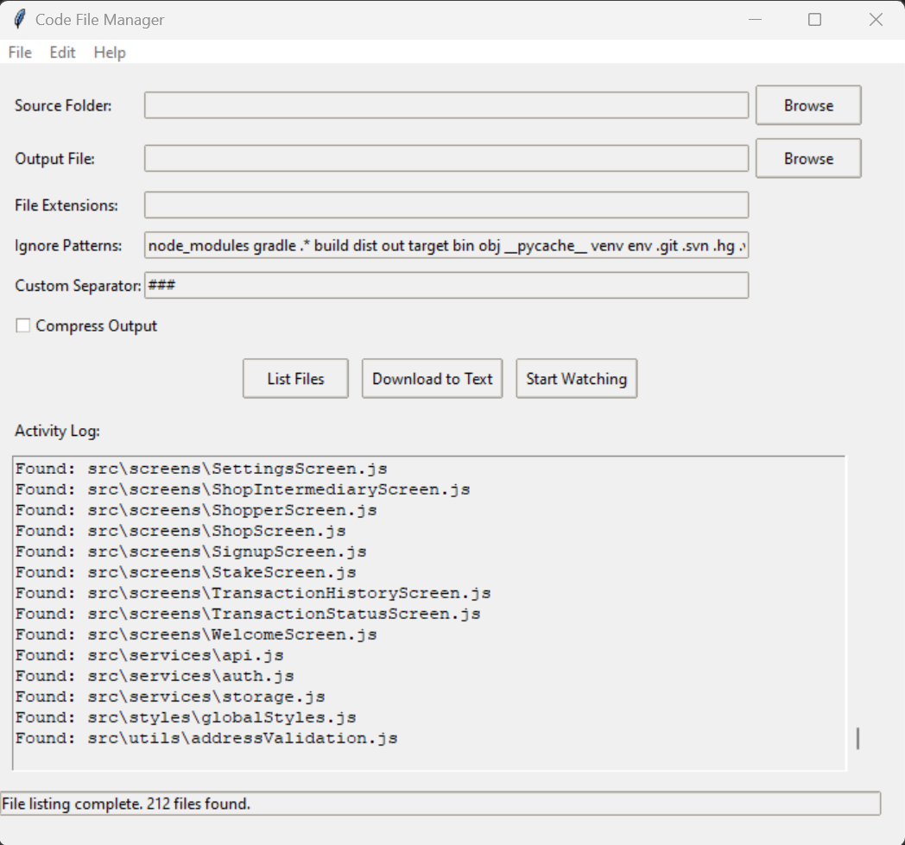

# Mirrorepo

## Overview

The Mirrorepo is a Python-based tool designed for efficient code file consolidation and real-time monitoring. It provides a GUI interface built with Tkinter and leverages the watchdog library for file system event handling.



## Key Features

- File consolidation with custom filtering and metadata inclusion
- Real-time file watching and incremental updates
- Compression support for output files
- Cross-platform compatibility (Windows, macOS, Linux)
- Dark mode support
- Keyboard shortcuts for common operations

## Technical Specifications

- **Language:** Python 3.6+
- **GUI Framework:** Tkinter
- **File Watching:** watchdog library
- **Diff Algorithm:** difflib
- **Compression:** gzip

## Installation

1. Clone the repository:
   ```
   git clone https://github.com/flexfinRTP/mirrorepo.git
   ```

2. Install dependencies:
   ```
   pip install -r requirements.txt
   ```

## Usage

### GUI Mode

Launch the application:
```
python autocodetext.py
```

### CLI Mode

```
python autocodetext.py --folder /path/to/code --output output.txt --extensions py js --ignore *.log temp/* --compress
```

Run with `--help` for full CLI options.

## Code Structure

- `CodeFileManager`: Core logic for file processing and watching
- `App`: GUI implementation using Tkinter
- `CodeChangeHandler`: Watchdog event handler for file changes
- `ToolTip`: Custom tooltip implementation
- `TextHandler`: Custom logging handler for GUI integration

## Configuration

Use `config.json` for default settings:

```json
{
  "default_folder": "/path/to/default/folder",
  "default_output": "default_repo.txt",
  "default_extensions": [".py", ".js", ".html"],
  "default_ignore_patterns": ["*.log", "temp/*"],
  "default_separator": "###",
  "compress_by_default": false
}
```

## Performance Considerations

- Incremental updates minimize I/O operations
- Multi-threading support for large codebases
- Efficient diff algorithm for change detection

## API Reference

### CodeFileManager

```python
class CodeFileManager:
    def __init__(self)
    def read_file(self, file_path)
    def write_output(self, content)
    def get_file_metadata(self, file_path)
    def process_folder(self)
    def update_output_file(self, changed_file)
    def start_watching(self)
    def stop_watching(self)
```

### App

```python
class App(tk.Tk):
    def __init__(self)
    def create_widgets(self)
    def create_menu(self)
    def bind_shortcuts(self)
    def configure_styles(self)
    def toggle_dark_mode(self)
    def download_to_text(self)
    def toggle_watch(self)
    def show_progress(self, generator)
```

## Troubleshooting

1. **File Permission Issues:** Ensure appropriate read/write permissions.
2. **Watcher Not Detecting Changes:** Verify correct folder path and IDE save behavior.
3. **High CPU Usage:** Adjust polling interval or exclude frequently changing files.

## Contributing

1. Fork the repository
2. Create a feature branch
3. Commit changes
4. Push to the branch
5. Open a Pull Request

## License

This project is licensed under the MIT License.